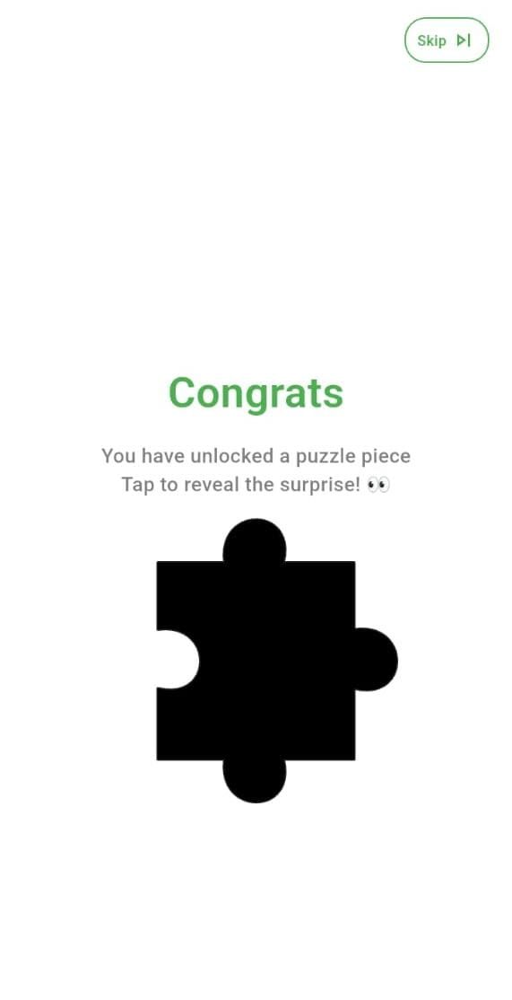

# Puzzle Reward Package

A **Flutter package** that allows developers to integrate interactive puzzle games into their applications. Users solve puzzles to unlock rewards, with customizable UI, storage options, and animations.

---

## ✨ Features
- 🎮 Interactive drag-and-drop **4x4 puzzle game**
- 🎉 Reward unlocking with **Lottie animations** and images
- 🔒 Multiple storage options:
  - SharedPreferences
  - REST API (Basic / JWT)
  - Firebase Firestore
- 🎨 Customizable colors, texts, and puzzle piece shapes
- ⚡ Smooth animations for reveal, drag, drop, and unlock screens
- 📦 Modular structure with controllers, models, and utils

---

## 📦 Installation

Add the following to your `pubspec.yaml`:

```yaml
dependencies:
  puzzle_reward_package:^1.0.0
```

Run:
```bash
flutter pub get
```

---

## 🚀 Usage

### Import the package
```dart
import 'package:puzzle_reward_package/puzzle_reward_package.dart';
```

### Example with SharedPreferences
```dart
PuzzleGameScreen(
  config: PuzzleConfig(
    puzzleImages: [
      'assets/images/puzzle_piece.png',
      'assets/images/puzzle_piece-4.png',
      'assets/images/puzzle_piece-8.png',
      'assets/images/puzzle_piece-12.png',
      'assets/images/puzzle_piece-1.png',
      'assets/images/puzzle_piece-5.png',
      'assets/images/puzzle_piece-9.png',
      'assets/images/puzzle_piece-13.png',
      'assets/images/puzzle_piece-2.png',
      'assets/images/puzzle_piece-6.png',
      'assets/images/puzzle_piece-10.png',
      'assets/images/puzzle_piece-14.png',
      'assets/images/puzzle_piece-3.png',
      'assets/images/puzzle_piece-7.png',
      'assets/images/puzzle_piece-11.png',
      'assets/images/puzzle_piece-15.png',
    ],

    lottieAnimationPath: 'assets/animations/SmjpT6YB5S.json',
    rewardImage: 'assets/images/example.png',

    congratsTitle: 'बधाई हो!',
    congratsSubtitle: 'आपने एक puzzle piece unlock किया है!',
    unlockButtonText: 'UNLOCK करें',

    primaryColor: Colors.green,
    buttonColor: Colors.black,

    storageType: StorageType.sharedPreferences,

    onComplete: () {
      print('Puzzle completed!');
    },
    onSkip: () {
      print('Puzzle skipped!');
    },
  ),
)
```

### Example with REST API (Basic)
```dart
PuzzleGameScreen(
  config: PuzzleConfig(
    puzzleImages: [...],

    storageType: StorageType.basicApi,
    getApiUrl: 'https://yourapi.com/puzzle-progress',
    postApiUrl: 'https://yourapi.com/save-progress',

    primaryColor: Colors.blue,
    buttonColor: Colors.orange,

    onComplete: () {
      print('Puzzle completed with API storage!');
    },
  ),
)
```

### Example with REST API (JWT)
```dart
PuzzleGameScreen(
  config: PuzzleConfig(
    puzzleImages: [...],

    storageType: StorageType.jwtApi,
    getApiUrl: 'https://yourapi.com/puzzle-progress',
    postApiUrl: 'https://yourapi.com/save-progress',
    jwtToken: 'YOUR_JWT_TOKEN',

    primaryColor: Colors.red,
    buttonColor: Colors.black,
  ),
)
```

### Example with Firebase
```dart
PuzzleGameScreen(
  config: PuzzleConfig(
    puzzleImages: [...],

    storageType: StorageType.firebase,
    userId: 'unique_user_id',

    primaryColor: Colors.deepPurple,
    buttonColor: Colors.amber,

    onComplete: () {
      print('Puzzle completed with Firebase storage!');
    },
  ),
)
```

---

## ⚙️ Configuration Options

### `PuzzleConfig`
- **puzzleImages** *(List<String>)* → 16 puzzle image paths (mandatory)
- **lottieAnimationPath** *(String?)* → Path to Lottie animation
- **rewardImage** *(String?)* → Path to reward image
- **congratsTitle** *(String)* → Title text after puzzle completion
- **congratsSubtitle** *(String)* → Subtitle text after completion
- **unlockButtonText** *(String)* → Text for unlock button
- **primaryColor** *(Color)* → Theme color for UI
- **buttonColor** *(Color)* → Unlock button color
- **bulgeSize / bulgeDepth / bulgeStartFraction / bulgeEndFraction** *(double)* → Customize puzzle piece shape
- **storageType** *(StorageType)* → Storage method (`sharedPreferences`, `basicApi`, `jwtApi`, `firebase`)
- **getApiUrl / postApiUrl / deleteApiUrl** *(String?)* → API endpoints for saving progress
- **jwtToken** *(String?)* → JWT token for API auth
- **userId** *(String?)* → Required for Firebase storage
- **onComplete** *(Function?)* → Callback when puzzle is completed
- **onSkip** *(Function?)* → Callback when skipped

---

## 📂 Storage Options

1. **SharedPreferences** → Stores puzzle progress locally.
2. **Basic API** → Requires `getApiUrl` and `postApiUrl`.
3. **JWT API** → Requires `getApiUrl`, `postApiUrl`, and `jwtToken`.
4. **Firebase** → Requires `userId` and Firebase Firestore setup.

---

## 📸 Screenshots
### 🔒 Locked State


### 🔓 Unlocked State


### 🧩 Puzzle Gameplay (4x4 Board)


### 🎉 Completion Screen

---

## 🛠️ Development

Clone the repo and run example:
```bash
git clone https://github.com/your-repo/puzzle_reward_package.git
cd puzzle_reward_package
flutter run example
```

---

## 🤝 Contributing
Contributions are welcome! Please fork the repo and submit a PR.

---

## 📜 License
This project is licensed under the MIT License.

